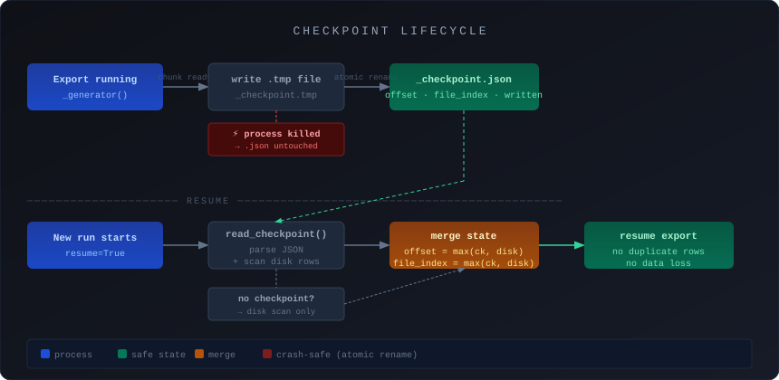
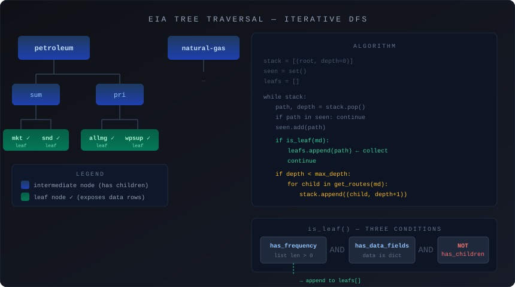
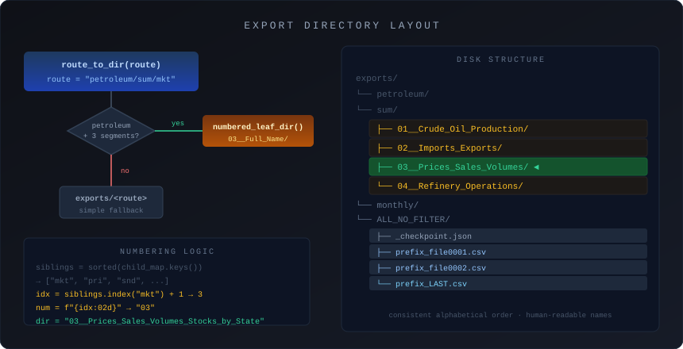
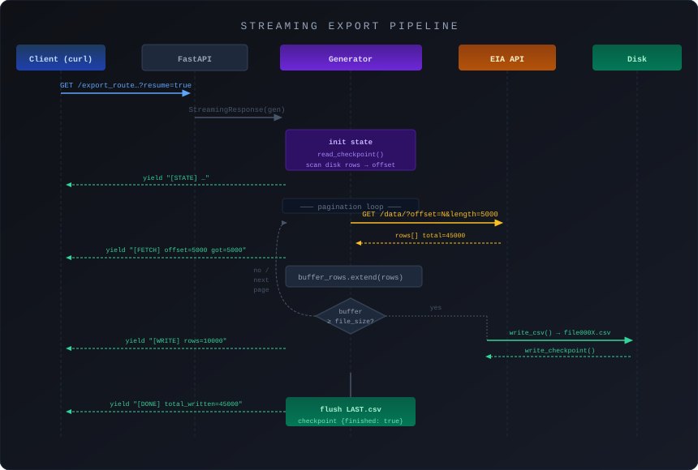
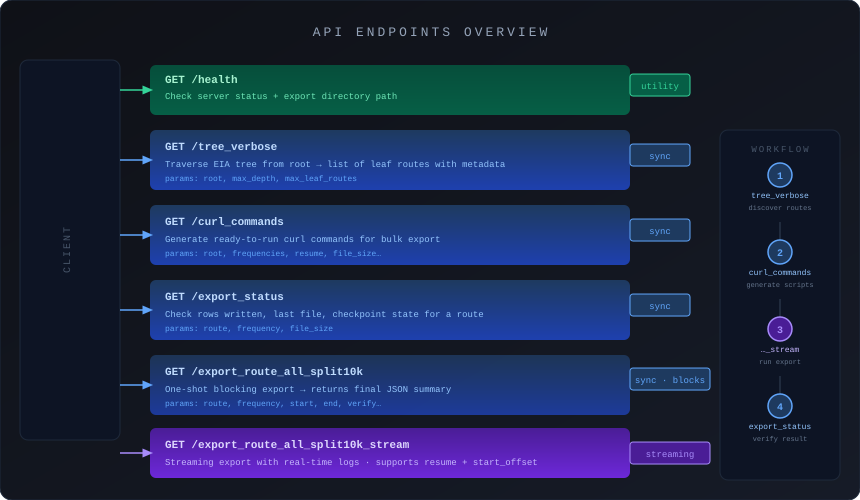

# Documentation of main.py

---

## Checkpoint management

Checkpoints persist the export state so that an interrupted download can be resumed exactly where it left off, with no duplicate rows.



```
exports/
└── petroleum/sum/mkt/
    └── monthly/ALL_NO_FILTER/
        ├── _checkpoint.json       ← persisted state (offset, file index, total written…)
        ├── prefix_file0001.csv
        ├── prefix_file0002.csv
        └── prefix_LAST.csv        ← remainder rows (< file_size)
```

`write_checkpoint` uses an atomic `.tmp` → rename write to guarantee the file is never left in a corrupt state if the process is killed mid-write.

---

## HTTP wrapper — `_safe_get_json`

Makes every EIA API call resilient through exponential backoff. Each failed attempt waits longer before retrying: `sleep = 0.6 × 2^attempt + jitter`.


```
Attempt 1  ──► EIA API ──► OK? ──────────────────────────────► return payload
                  │
             network error / 429 / 5xx / non-JSON?
                  │
                  ▼
         sleep = 0.6 × 2^attempt + random(0.2s)
                  │
Attempt 2  ──► EIA API
     ...
Attempt 8  ──► last chance ──► still failing? → raise HTTPException 502
```

**Decision tree per attempt:**

| Response | Action |
|---|---|
| Network exception | Retry |
| 429 / 500 / 502 / 503 / 504 | Retry |
| Non-JSON body | Retry |
| JSON `{"error": ...}` | Raise 400 immediately |
| JSON without `response` key | Retry |
| HTTP status ≠ 200 (other) | Raise immediately |
| Valid payload | Return |

---

## EIA tree traversal

The EIA API is organized as a tree. Only **leaf routes** (terminal nodes with no children) actually expose data rows.



```
root (e.g. petroleum)
├── sum                        ← intermediate node
│   ├── mkt   ✓ leaf           frequencies: [monthly, weekly]
│   └── snd   ✓ leaf           frequencies: [annual]
└── pri                        ← intermediate node
    └── allmg ✓ leaf           frequencies: [monthly]
```

`discover_leaf_routes` uses an **iterative DFS** (stack of `(path, depth)` tuples) rather than recursion to avoid Python stack overflow on deep trees. A `seen` set prevents revisiting the same path twice.

A route is considered a **leaf** when it satisfies all three conditions simultaneously:

```
has_frequency  AND  has_data_fields  AND  NOT has_children
```

---

## Export directory layout

Petroleum leaf routes get a **numeric prefix** derived from their alphabetical position among siblings, so exports sort consistently on disk regardless of when they were created.



```
route: petroleum/sum/mkt
                        ↓  position of "mkt" among sorted siblings = 3
exports/
└── petroleum/
    └── sum/
        └── 03__Prices_Sales_Volumes_Stocks_by_State/
            └── monthly/
                └── ALL_NO_FILTER/
                    ├── _checkpoint.json
                    ├── petroleum_sum_mkt_monthly_file0001.csv
                    └── petroleum_sum_mkt_monthly_LAST.csv
```

Non-petroleum routes fall back to `exports/<route>` with no numbering.

---

## Streaming export — `_export_route_all_split10k_generator`

Core export engine. It paginates the EIA API, accumulates rows in a buffer, flushes to disk every `file_size` rows, and yields a log line after each operation so the caller gets live feedback.



```
Client (curl --no-progress-meter)
    │
    │  GET /export_route_all_split10k_stream?route=...&resume=true
    │
    ▼
FastAPI StreamingResponse  (media_type: text/plain)
    │
    ▼
_export_route_all_split10k_generator()
    │
    ├─ [STATE / START]  log initial state
    │
    └─ loop ──► _safe_get_json() ──► EIA API (offset, length=api_page_size)
                    │
                    ▼
               buffer_rows[]  ◄── accumulate
                    │
              buffer ≥ file_size?
                    │ yes
                    ▼
              write_csv()  ──► prefix_file000X.csv
              write_checkpoint()  ──► _checkpoint.json
              yield "[WRITE] ..."
                    │
              offset >= total OR last page?
                    │ yes → break
    │
    ├─ flush remainder ──► prefix_LAST.csv
    ├─ write final checkpoint  (finished: true)
    └─ yield "[DONE] ..."
```

**Resume startup logic:**

```
resume=True?
    ├─ checkpoint exists? → offset = max(checkpoint.next_offset, disk_rows)
    └─ no checkpoint      → offset = disk_rows (scan only)

resume=False + start_offset > 0?
    └─ offset = max(disk_rows, start_offset)
```

On any exception, the checkpoint is updated with the error detail before the generator exits, so the next run picks up from the right offset.

---

## FastAPI endpoints overview



| Endpoint | Mode | Use case |
|---|---|---|
| `GET /health` | — | Check server is up |
| `GET /tree_verbose` | sync | Explore available routes and their metadata |
| `GET /curl_commands` | sync | Generate bulk export commands for a shell script |
| `GET /export_status` | sync | Check progress of an ongoing or finished export |
| `GET /export_route_all_split10k` | sync (blocking) | One-off export, waits for completion |
| `GET /export_route_all_split10k_stream` | streaming | Long export with real-time log output |

### Typical workflow

```
1. /tree_verbose?root=petroleum/sum
       → discover leaf routes + available frequencies

2. /curl_commands?root=petroleum/sum&frequencies=monthly,weekly
       → get ready-to-run curl commands

3. curl "…/export_route_all_split10k_stream?route=…&resume=true" | tee run.log
       → stream the export, watch logs live

4. /export_status?route=…&frequency=monthly
       → verify row counts and checkpoint state
```